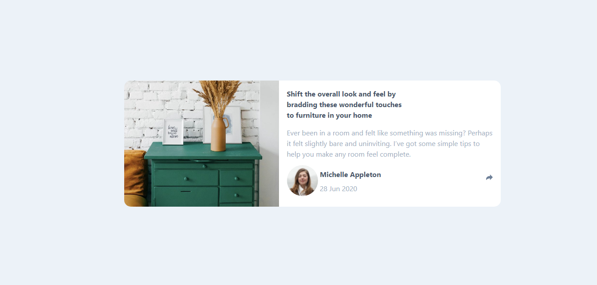

# Frontend Mentor - Article preview component solution

## Table of contents

- [Overview](#overview)
  - [The challenge](#the-challenge)
  - [Screenshot](#screenshot)
  - [Links](#links)
- [My process](#my-process)
  - [Built with](#built-with)
  - [What I learned](#what-i-learned)
  - [Useful resources](#useful-resources)
- [Author](#author)

## Overview

### The challenge

Users should be able to:

- View the optimal layout for the component depending on their device's screen size
- See the social media share links when they click the share icon

### Screenshot

### Links

- Solution URL: [https://www.frontendmentor.io/solutions/article-preview-component-using-html-css-js-and-bootstrap-sjEX2Ybu6](https://www.frontendmentor.io/solutions/article-preview-component-using-html-css-js-and-bootstrap-sjEX2Ybu6)
- Live Site URL: [https://article-preview-component-frontend-mentor.netlify.app/](https://article-preview-component-frontend-mentor.netlify.app/)

## My process

To create this project, firstly, I used Bootstrap framework which enables me to create Mobile first webpage and then easily convert it into desktop using rows and cols and make changes according to the need of screen size using @media query.

### Built with

- Semantic HTML5 markup
- CSS custom properties
- Bootstrap - Mobile first

### What I learned

With this project, I get to know about the way to create a tooltip and also about the way to add class using javascript with the click of a button.

### Useful resources

- [Bootstrap](https://getbootstrap.com/) - this helped me in creating mobile-first webpage and also easy convering to desktop.

## Author

- Website - [Varun Grover](https://thevarungrovers.vercel.app)
- Frontend Mentor - [@thevarungrovers](https://www.frontendmentor.io/profile/thevarungrovers)
- Twitter - [@thevarungrovers](https://www.twitter.com/thevarungrovers)
